# InTune

**Say it your way. Send it only when it's right.**

**Live:** https://intune-eta.vercel.app · deployed automatically from `main` on Vercel

InTune is a private communication community for adults who choose communication support, and the people they talk with. You can express a message by typing, tapping phrases, recording up to 30 seconds of audio, or recording a 15-second video. Gemini helps turn it into words and asks one question when something is unclear. Nothing is sent until you approve the exact text and audience. Recipients can open a private "Make clearer" version of any message and reply the same way.

## Demo video (6:06)

[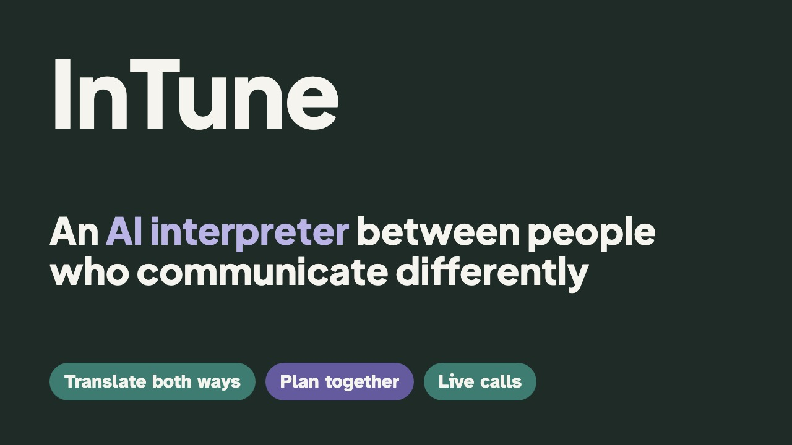](https://github.com/ShaikNagurShareef/InTune/raw/main/media/intune-demo.mp4)

**[▶ Watch the demo (MP4, 1080p, captions burned in)](https://github.com/ShaikNagurShareef/InTune/raw/main/media/intune-demo.mp4)**. Also in the repo: captions ([SRT](media/intune-demo.srt), [VTT](media/intune-demo.vtt)) and [YouTube title, description and chapters](media/YOUTUBE.md).

It covers:
- why we built it and the research behind it;
- translation in both directions, with exact approval;
- personal phrases;
- joining a circle safely;
- Plan it together;
- live calls with an AI interpreter;
- how InTune differs from a chat app with an AI assistant;
- privacy and data protection.

Every AI result in the video is live. It was recorded automatically from the deployed app with `npm run video` (see `video/` and `.claude/skills/intune-demo-video`). The narration is natural neural speech from [Kokoro](https://huggingface.co/hexgrad/Kokoro-82M) (open source, run locally), with a separate voice for the creator's own story.

## Screenshots

All screenshots are from the live app with the fictional demo accounts; the AI output shown is real. Refresh them with `npm run screenshots`.

<table>
  <tr>
    <td width="50%">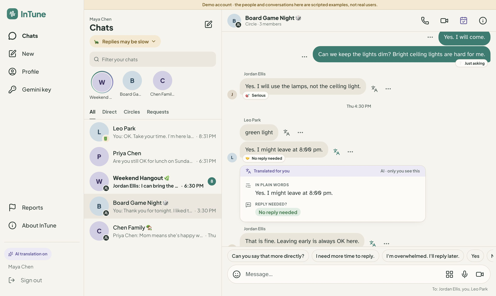<br><b>Chats:</b> private circles and direct chats, energy status, tone tags such as “no reply needed”</td>
    <td width="50%">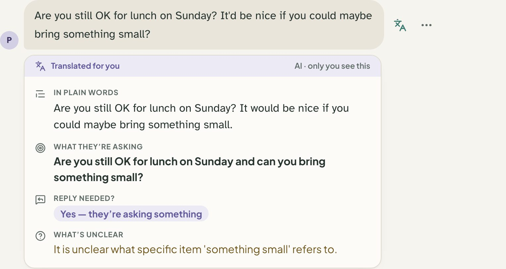<br><b>Understanding what others mean:</b> plain words, the actual ask, whether to reply, what’s unclear. Only the reader sees it.</td>
  </tr>
  <tr>
    <td>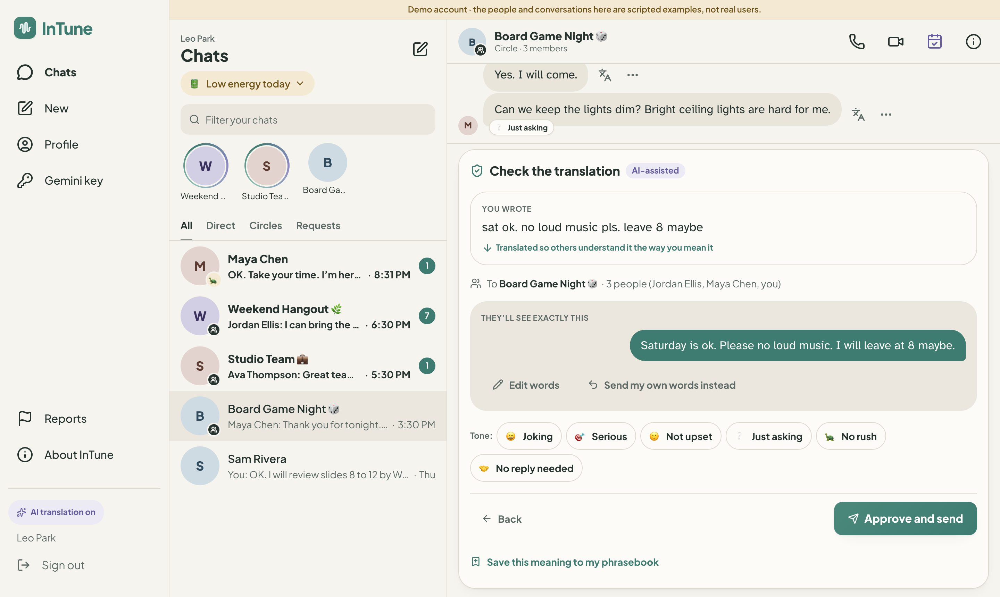<br><b>Being understood:</b> shorthand in clear words; you approve the exact text and audience before anything is sent</td>
    <td>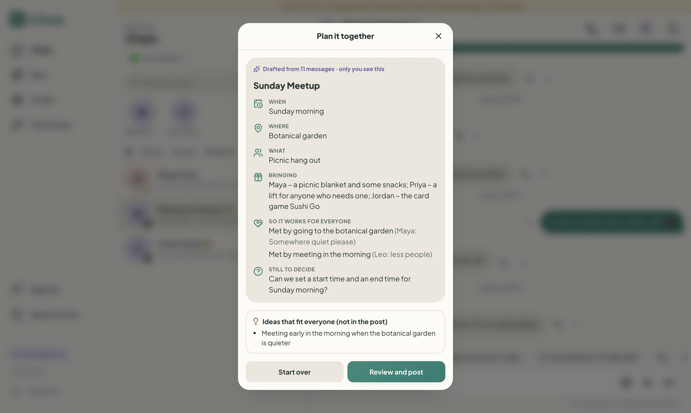<br><b>Plan it together:</b> a scattered group chat becomes one plan that meets each person’s stated needs</td>
  </tr>
  <tr>
    <td>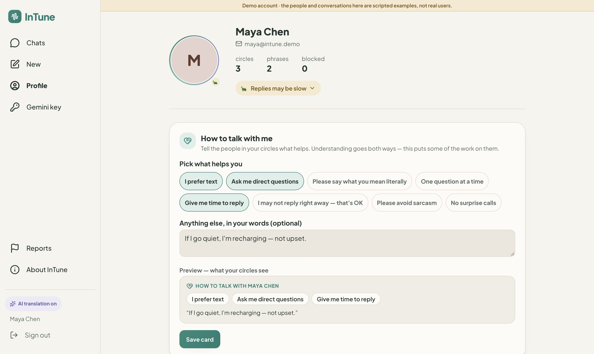<br><b>How to talk with me:</b> each person shares what helps, plus their own phrasebook and calm colour themes</td>
    <td>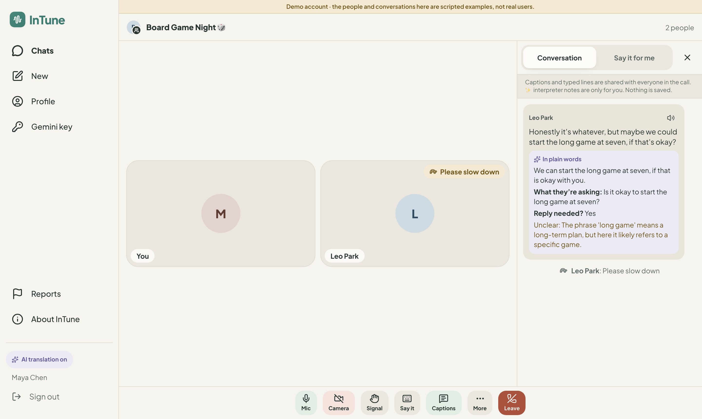<br><b>Live calls:</b> captions, a private AI interpreter, one-tap signals, and “say it for me”. Nothing is recorded.</td>
  </tr>
</table>

<p align="center">
  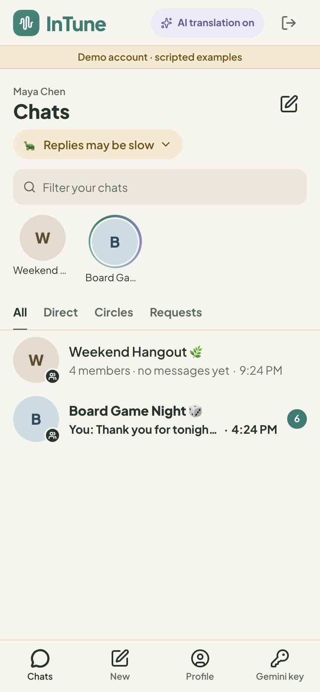
  &nbsp;&nbsp;
  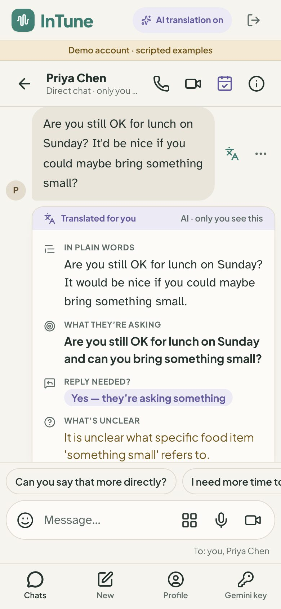
  <br><b>On phones:</b> the same app, with bottom tabs and large touch targets
</p>

**For judges:** [SUBMISSION.md](SUBMISSION.md) (who it's for, how it strengthens connection, why AI is essential) · [DEMO_VIDEO.md](DEMO_VIDEO.md) (2:45 demo script).

Built by **Coding Claws** (Nagur Shareef Shaik, Sahith Reddy Thummala, Pranav Nagothu, Geethanjali Nagaboina) for HackGT 13 (Meta challenge: *Bringing People Closer Together with AI*) from `InTune_Project_Requirements.docx`, using the [ECC](https://github.com/affaan-m/ECC) Claude Code harness.

## Try it

**Fastest:** open the live site and press **Try as Maya Chen** (or any demo person) on the sign-in page. The demo has scripted autistic ↔ autistic and autistic ↔ non-autistic conversations — see [DEMO.md](DEMO.md) for the cast and a four-minute walkthrough, including a live call.

Or start fresh:

1. Create an account, then create a circle.
2. Invite someone with a private, single-use link (expires in 24 hours).
3. Optional: open **Gemini key** and paste your own [Gemini API key](https://aistudio.google.com/apikey). Without a key, typing, phrases, sending, reading, listening, blocking and reporting all still work.
4. Write something like *"want come dinner friday loud outside?"* and press **Help me word it**.

## Plan it together

In any circle, **Plan it together** reads the recent chat plus what each member shared in *How to talk with me*. It drafts one plan everyone can enjoy:
- when, where and what;
- who brings what;
- how the plan meets each person's stated needs (for example a quiet place, a morning start, or exact start and end times);
- up to three direct yes/no questions for anything still open.

Only real members can appear in the plan, and its layout is always the same. The organiser sees the plan privately first, then approves the exact text before it's posted (`src/lib/services/plan.ts`).

## Live calls with an AI interpreter

Every circle and direct chat has **voice** and **video** calls (1-to-1 and group), built on [LiveKit](https://livekit.io) (open-source WebRTC SFU; LiveKit Cloud's free tier in production). They're designed to be calm and to keep everyone in the conversation:

- **Pre-join check:** see who's already there, preview your camera, and choose your help before joining. The camera is off for voice calls, and your own video is hidden from you by default.
- **Live captions:** your browser turns your speech into text and shares it with the call.
- **✨ AI interpreter (private to you):** each line someone says is shown in plain words, with *what they're asking* and *reply needed?*. Dropped names, times or "not"s are flagged by the same critical-slot check used for messages.
- **Say it for me:** type (or tap a quick phrase) and everyone sees it and hears it read aloud. ✨ can suggest clearer wording, but you approve it before it's said.
- **One-tap signals:** *I want to speak · Please slow down · Please say that again · I need a short break · Yes · No*.
- **Steady screen:** tiles never reorder when someone speaks, a soft ring shows who's talking, and a gentle "reconnecting" notice appears instead of a frozen screen. Adaptive streaming, dynacast and simulcast keep weak connections smooth.
- **Nothing is recorded:** captions, interpreter notes and typed lines travel over the call's data channel and disappear when you leave. Only the call's start and end time are stored.

Why LiveKit: we compared it with Daily, Agora, 100ms and Twilio Video. It's open source (so it can be self-hosted), has a generous free tier and first-class React components and data channels, and has no per-minute lock-in. Calls are optional: without `LIVEKIT_*` env vars the call buttons are hidden and everything else works.

## How it protects the person's voice

| Guarantee | Where it's enforced |
| --- | --- |
| No message is sent without approval of the exact text and audience; any edit or membership change invalidates it | `src/lib/services/publish.ts` (`approveDraft`, `publishMessage`) |
| Retried or double-clicked sends create one post | Unique `(sender_id, idempotency_key)` + payload hash, one transaction |
| The model can't approve, send or change who sees a message | Delivery is app code, never a LangGraph node or model tool; state fields are server-only (strict schemas) |
| It asks instead of guessing | LangGraph `clarify` interrupt, one question, up to 3 choices + "Something else", max two automatic rounds |
| Lost "no / not", dates, numbers or invented feelings are flagged and must be acknowledged | Model meaning check + deterministic critical-slot diff (`src/lib/meaning/critical-slots.ts`) |
| Your key stays yours | BYOK: stored only in your browser; sent per request; never persisted, logged or checkpointed (tested) |
| Recordings stay private | Private Blob store, verified by signature and size, erased after transcription or within 24 h |
| Unrelated users learn nothing | Every route checks session + membership/ownership and returns the same 404 |
| A plan is only a suggestion until it's approved | Plans are AI-assisted drafts bound to the organiser's exact approval, like any message (`src/lib/services/plan.ts`) |
| Calls stay in the circle | Join tokens are issued per call to current members only (blocks respected), scoped to one room, short-lived; nothing from a call is recorded |

## Architecture

### System overview

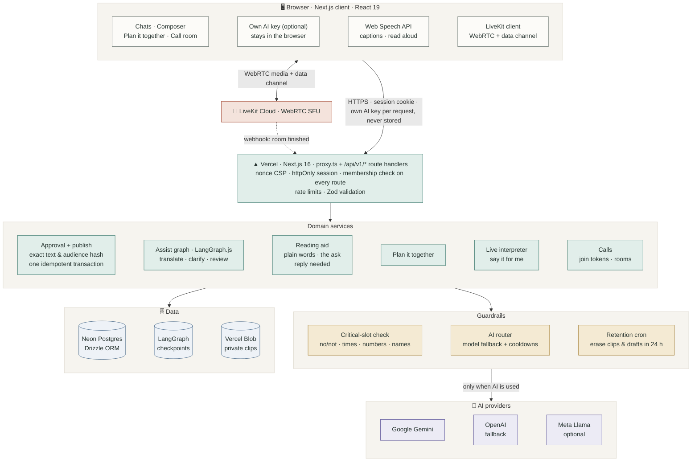

### Translate, clarify, review (LangGraph)

AI output only ever reaches a draft. Nothing is sent from inside the graph.

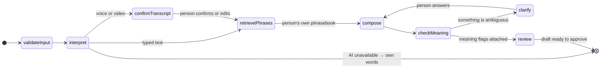

### Sending: exact approval, then one idempotent publish

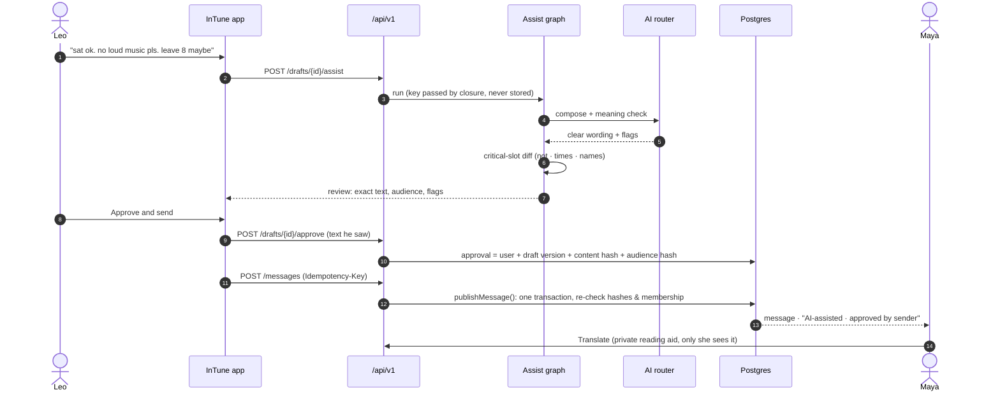

### Live call with the interpreter

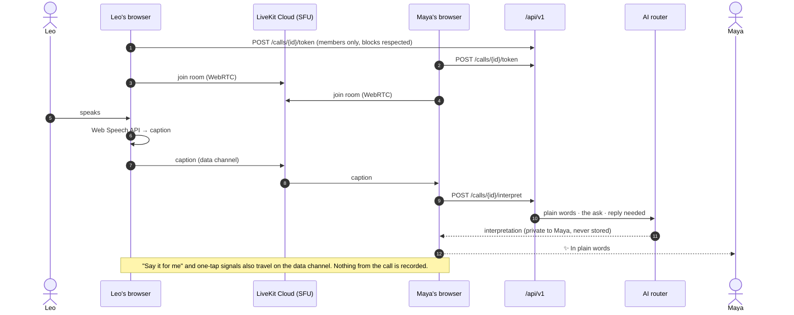

## Tech stack

| Layer | Technology | Why |
| --- | --- | --- |
| Web app | **Next.js 16.3** (App Router), **React 19.2**, **TypeScript 5** | One codebase for UI and API; server components; deploys to Vercel |
| UI | **Tailwind CSS 4**, lucide-react, SWR, Atkinson Hyperlegible + Plus Jakarta Sans fonts | Calm, readable themes (Calm, Soft dark, High contrast); polling with a stable order |
| AI orchestration | **LangGraph.js 1.4** + Postgres checkpointer | Resumable translate → clarify → review flow with human-in-the-loop pauses |
| AI models | **Google Gemini** (`@google/genai` 2.x), **OpenAI** (`openai` 7.x), optional **Meta Llama** (Llama API, Groq or Together) | Automatic fallback across models and providers on rate limits and overload |
| Meaning safety | Deterministic critical-slot check, Zod 4 schemas for every model reply | A lost "not", time, number, name or condition is flagged; malformed output is rejected |
| Live calls | **LiveKit** (WebRTC SFU): livekit-client 2.22, @livekit/components-react 2.9, livekit-server-sdk 2.19 | Adaptive stream, dynacast and simulcast; data channel for captions and signals |
| Speech | Browser **Web Speech API** (captions) and **speech synthesis** (read aloud) | On-device; nothing is recorded |
| Database | **Neon Postgres**, **Drizzle ORM** 0.45 with migrations, `pg` | Transactions for approval and publishing; unique idempotency keys |
| Files | **Vercel Blob** (private) | Voice and video clips, erased once turned into words or within 24 h |
| Auth & security | `jose` sessions (httpOnly cookie), bcryptjs, nonce CSP, origin (CSRF) checks, rate limits | Every route checks the session and membership; outsiders get a non-disclosing 404 |
| Hosting | **Vercel** (auto-deploy from `main`, cron for retention) | https://intune-eta.vercel.app |
| Testing | **Vitest 5** + PGlite (in-memory Postgres), **Playwright 1.63** (two-browser flows incl. a real call), ESLint 9 | 103 unit/integration tests, 5 end-to-end tests |
| Demo video | Playwright (CDP screencast), ElevenLabs or macOS voice, ffmpeg + libass | `npm run video` re-records the live app with narration and captions |
| Dev harness | [ECC](https://github.com/affaan-m/ECC) for Claude Code | Rules, review agents and skills used while building |

**Realtime:** messages update by polling every 3 s with a stable `(created_at, id)` order, because Vercel has no websockets. Calls use LiveKit (WebRTC media plus data channels).

**Spec endpoints:**
- Drafts and AI help:
  - `POST /v1/drafts`
  - `PATCH /v1/drafts/{id}` (expected_version)
  - `POST /v1/drafts/{id}/assist`
  - `GET /v1/jobs/{id}`
  - `POST /v1/jobs/{id}/clarify`
- Approving and sending:
  - `POST /v1/drafts/{id}/approve`
  - `POST /v1/messages` (Idempotency-Key)
- Reading:
  - `GET /v1/circles/{id}/messages` (cursor)
  - `POST /v1/messages/{id}/simplify`
- Plans and calls:
  - `POST /v1/circles/{id}/plan`
  - `POST /v1/circles/{id}/calls`
  - `POST /v1/calls/{id}/{token|interpret|say|end}`
- Also: circles, invites, membership, phrasebook, blocks, reports, media and account deletion.

## Evaluation

`/benchmarks` shows B0 (no model) vs B1 (one prompt) vs B2 (full workflow) on 110 InTune-authored fixtures, split into dev and held-out sets, with raw counts. See `eval/manifest.json` for fixture hashes, what's deferred (LibriSpeech, TORGO, UASpeech, ASSET) and why. These are automatic checks on custom scripted cases, not a clinical or public benchmark; human review is pending.

```bash
npm run eval -- --baseline B0 --split dev
GEMINI_API_KEY=... npm run eval -- --baseline B2 --split heldout
```

## Develop

```bash
cp .env.example .env.local           # DATABASE_URL, AUTH_SECRET
npm install
npm run db:migrate                   # app schema + LangGraph checkpoint tables
npm run dev
npm test                             # Vitest on in-process Postgres (PGlite), stubbed Gemini
livekit-server --dev                 # optional, for calls (brew install livekit); LIVEKIT_* in .env.example
npm run test:e2e                     # Playwright two-browser flows incl. a call (test-only Gemini stub)
```

## Scope and limits

Built: all P0 requirements in the spec. Deferred: P1 (visual object context, activity RSVP, more languages, MCP adapter) and P2 (streaming, public communities, A2A, WhatsApp, acoustic training). Known limits are listed in the app at `/about`, including: English only; polling instead of push; server duration checks are best-effort for some recorder formats; circle owners act as moderators; Gemini eligibility for the Meta challenge is unconfirmed.

InTune is communication support. It does not diagnose, infer mood or capacity, or provide therapy.
